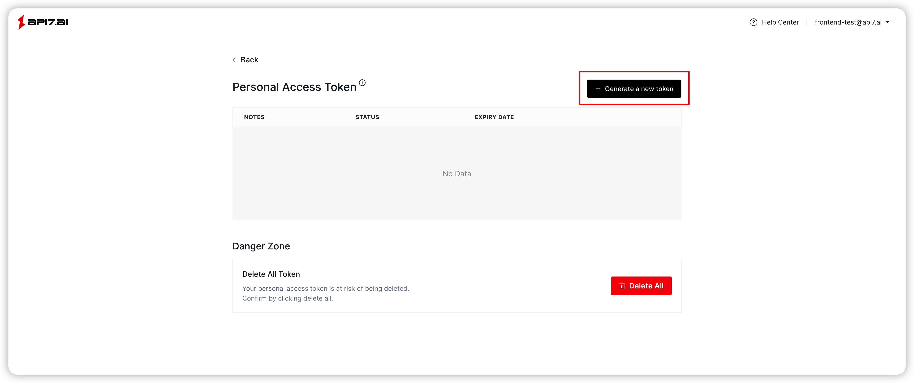
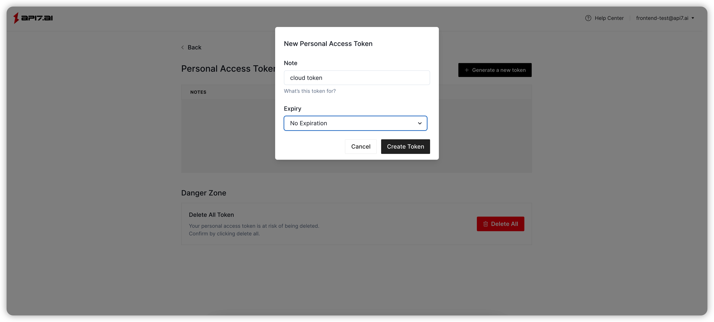

<!--
# Copyright 2022 API7.ai, Inc
#
# Licensed under the Apache License, Version 2.0 (the "License");
# you may not use this file except in compliance with the License.
# You may obtain a copy of the License at
#
#     http://www.apache.org/licenses/LICENSE-2.0
#
# Unless required by applicable law or agreed to in writing, software
# distributed under the License is distributed on an "AS IS" BASIS,
# WITHOUT WARRANTIES OR CONDITIONS OF ANY KIND, either express or implied.
# See the License for the specific language governing permissions and
# limitations under the License.
-->

How to configure Personal Access Token for Cloud CLI
==================================================

In this section, you'll learn how to configure the Personal Access Token
for Cloud CLI, so that it can access
the [API7 Cloud API](https://docs.api7.cloud/swagger/).

Create Personal Access Token
---------------------------

First, you need to log in
to [API7 Cloud Web Console](https://console.api7.cloud) to create a **Personal
Access Token** associated with your account.







**NOTE**: This Token will have the permission to operate resources under your
account, so please save it carefully.

It is recommended to configure a reasonable expiry time for the Personal Access
Token, such as `30` days.

> Once it's leaked accidentally, you can revoke it on API7 Cloud to avoid possible
security risks.

Configure Personal Access Token for Cloud CLI
-------------------------------------------

After executing the `cloud-cli configure` command, cloud-cli will prompt you to
enter the Personal Access Token.

```shell
cloud-cli configure
API7 Cloud Access Token: {PASTE YOUR ACCESS TOKEN HARE}
```

When the token you entered is verified to be correct and valid, cloud-cli will
give the following prompt:

```shell
WARNING: your access token will expire at 2024-01-31T00:03:50+08:00
successfully configured api7 cloud access token, your account is jack@api7.ai
```

> Note Cloud CLI saves the access token to `$HOME/.api7cloud/config`.

Configure Multiple Profiles for Cloud CLI
----------------------------------------

`cloud-cli configure` uses `https://api.api7.cloud` as the server address for
API7 Cloud by default. If your control plane is created on another region,
then you can specify the server address with `--addr` and specify a name for the
current configuration to distinguish among multiple environments with `--profile`.

```shell
cloud-cli configure --addr https://api.aliyun-hk.api7.cloud --profile aliyun
```

The newly created profile will not become the default profile directly, we need to
manually switch to the new profile (`cloud-cli config switch <profile>`) before it
take effect, if you want it to take effect immediately after creation, you can use
the `-set-default` command to achieve that.

```shell
cloud-cli configure --addr https://api.aliyun-hk.api7.cloud --profile aliyun --set-default
```

Switch Between Configured Profiles
---------------------------------

Use `cloud-cli config switch <profile>` to switch between multiple profiles.

```shell
cloud-cli config switch us-east
```

View Configuration of Cloud CLI
------------------------------

When we configure multiple profiles, we will want to know which profile is currently
in use and the corresponding organization and control plane information. In this case,
we can use the `cloud-cli config view` command to see the full list of available profiles.

```shell
cloud-cli config view
+--------------+----------------+---------------+------------+----------------------------------+
| PROFILE NAME |  ORGANIZATION  | CONTROL PLANE | IS DEFAULT |        API7 CLOUD ADDRESS        |
+--------------+----------------+---------------+------------+----------------------------------+
| dev          | API7 dev       | default       | True       | https://dev.api7.cloud           |
| eu           | API7 eu center | default       | False      | https://api.api7.cloud           |
| aliyun       | API7 aliyun    | default       | False      | https://api.aliyun-hk.api7.cloud |
+--------------+----------------+---------------+------------+----------------------------------+
```

Now you can run other provided commands. Enjoy your journey!
