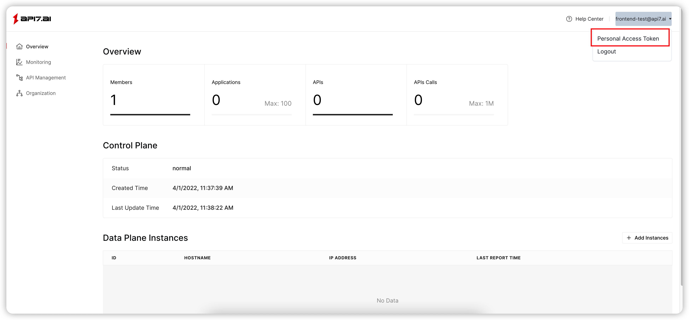
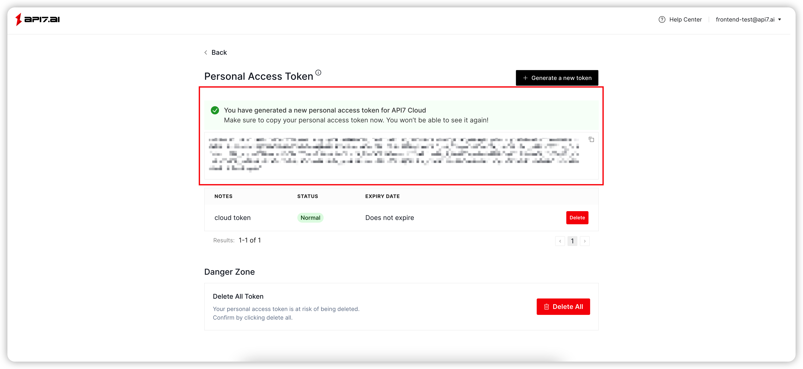

How to configure Personal Access Token for Cloud CLI
==================================================

In this section, you'll learn how to configure the Personal Access Token
for Cloud CLI, so that it can access
the [API7 Cloud API](https://docs.api7.cloud/swagger/).

Create Personal Access Token
---------------------------

First, you need to log in
to [API7 Cloud Web Console](https://console.api7.cloud) to create a **Personal
Access Token** associated with your account.






**NOTE**: This Token will have the permission to operate resources under your
account, so please save it carefully.

It is recommended to configure a reasonable expiry time for the Personal Access
Token, such as `30` days.

> Once it's leaked accidentally, you can revoke it on API7 Cloud to avoid possible
security risks.

Configure Personal Access Token for Cloud CLI
-------------------------------------------

After executing the `cloud-cli configure` command, cloud-cli will prompt you to
enter the Personal Access Token.

```shell
cloud-cli configure
API7 Cloud Access Token: {PASTE YOUR ACCESS TOKEN HARE}
```

When the token you entered is verified to be correct and valid, cloud-cli will
give the following prompt:

```shell
WARNING: your access token will expire at 2024-01-31T00:03:50+08:00
successfully configured api7 cloud access token, your account is jack@api7.ai
```

> Note Cloud CLI saves the access token to `$HOME/.api7cloud/credentials`.

Now you can run other protected commands. Enjoy your journey!
