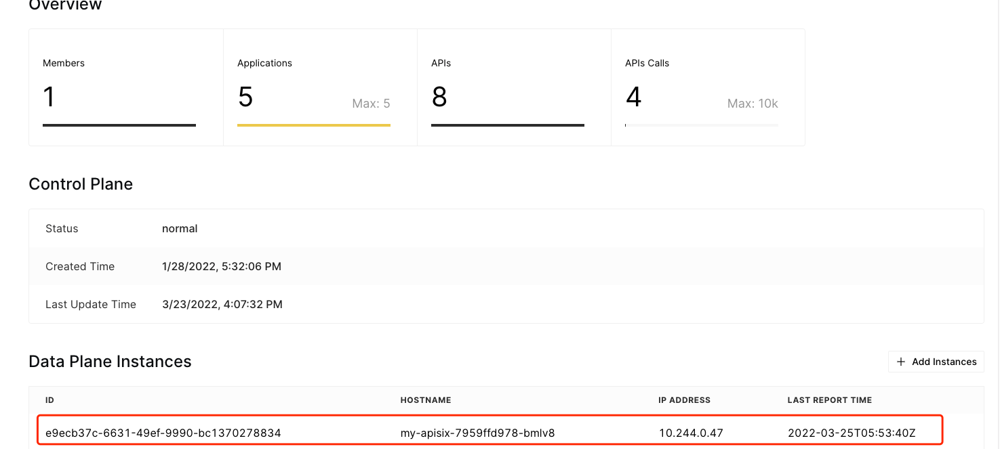

Deploy APISIX on Kubernetes
=======================

In this section, you'll learn how to deploy APISIX on Kubernetes through Cloud CLI.

> Note, before you go ahead, make sure you read the section
> [How to Configure Cloud CLI](./configuring-cloud-cli.md)

Cloud CLI will create Deployment, Service, ConfigMap, Secret, and Pod on Kubernetes for APISIX.

ConfigMap contains the `Cloud Lua Module`.

The Cloud Lua Module contains codes to communicate with API7 Cloud (such as
heartbeat, status reporting, etc.), it'll be downloaded every time you run the command.

> Currently, the Cloud Lua Module will be downloaded from [api7/cloud-scripts](https://github.com/api7/cloud-scripts).

Secret contains the `TLS Bundle`.

TLS Bundle (Certificate, Private Key, CA Bundle) will be downloaded from API7
Cloud, only instances with a valid client certificate can be connected to API7 Cloud.

> See the
> [DP Certificate API](https://docs.az-staging.api7.cloud/swagger/#/controlplanes_operation/getCertificates)
> to learn the details.

Cloud CLI deploy APISIX on Kubernetes through by [helm](https://helm.sh/), and it also downloads values template for the helm, which contains
the essential parts that APISIX needs to run, the configuration items in values are referenced into the deployment.yaml.

> See [config-default.yaml](https://github.com/apache/apisix/blob/master/conf/config-default.yaml)
> to learn the completed APISIX Configuration.
> See [deployment.yaml](https://github.com/apache/apisix-helm-chart/blob/master/charts/apisix/templates/deployment.yaml)
> and [helpers.tpl](https://github.com/apache/apisix-helm-chart/blob/master/charts/apisix/templates/_helpers.tpl)
> to learn configurations deployment for the kubernetes.
> See [Helm Values Template API](https://docs.az-staging.api7.cloud/swagger/#/controlplanes_operation/getControlPlaneStartupConfig)
> for the details.


Run Command
-----------

```shell
cloud-cli deploy kubernetes \
  --name my-apisix \
  --namespace apisix \
  --replica-count 1 \
  --apisix-image apache/apisix:2.11.0-centos \
  --helm-install-arg --output=table \
  --helm-install-arg --wait`

Congratulations! Your APISIX cluster was deployed successfully on Kubernetes.
The Helm release name is: my-apisix
The APISIX Deployment name is: "my-apisix"
The APISIX Service name is: "my-apisix-gateway"

Workloads:
Pod Name: my-apisix-7959ffd978-bmlv8 APISIX ID: e9ecb37c-6631-49ef-9990-bc1370278834
```

In this command, we:

1. name the helm release to `my-apisix`;
2. specify the namespace is `apisix`;
3. specify the APISIX pods replica is `2`;
4. specify the APISIX image `apache/apisix:2.11.0-centos`;
5. prints the output in the table format for helm install command;
6. wait until all Pods, PVCs, Services, and minimum number of Pods of a Deployment, StatefulSet, or ReplicaSet are in a ready state.

In this command, the following operations will be done:

1. create helm release that name is `my-apisix`;
2. create namespace on Kubernetes that name is `apisix`, if it not already existed;
3. create secret with name is `cloud-ssl` on namespace which name is `apisix`, if it not already existed;
4. create configMap with name is `cloud-module` on namespace which name is `apisix`, if it not already existed;
5. create Deployment, Service, Pod on namespace which name is `apisix`.

If you see the similar output about the Helm release name, APISIX Deployment name, APISIX Service name, Pod Name and APISIX ID, then your
APISIX instance is deployed successfully. You can redirect to API7 Cloud console
to check the status of your APISIX instance.


> You can also run the `kubectl get` command to check the status for this Deploying.

Besides, the service will expose two ports on its host for HTTP and HTTPS, so
you can access your APISIX instance through `node ip:port of http` (HTTP) or
`node ip:port of https` (HTTPS). And also, you can go into the Kubernetes 
cluster and access service or pods of APISIX instance directly

Stop Instance
-------------

If you want to stop the APISIX instance, just run the command below:

```shell
cloud-cli stop kubernetes \
  --name my-apisix \
  --namespace apisix
```

In this command, the following operations will be done:

1. delete helm release that name is `my-apisix`;
2. delete secret with name is `cloud-ssl` on namespace which name is `apisix`;
3. delete configMap with name is `cloud-module` on namespace which name is `apisix`;
4. delete Deployment, Service, Pod on namespace which name is `apisix`.


Command Option Reference
------------------------

You can run `cloud-cli deploy kubernetes --help` or `cloud-cli stop kubernetes --help` to learn 
the command line option meanings.